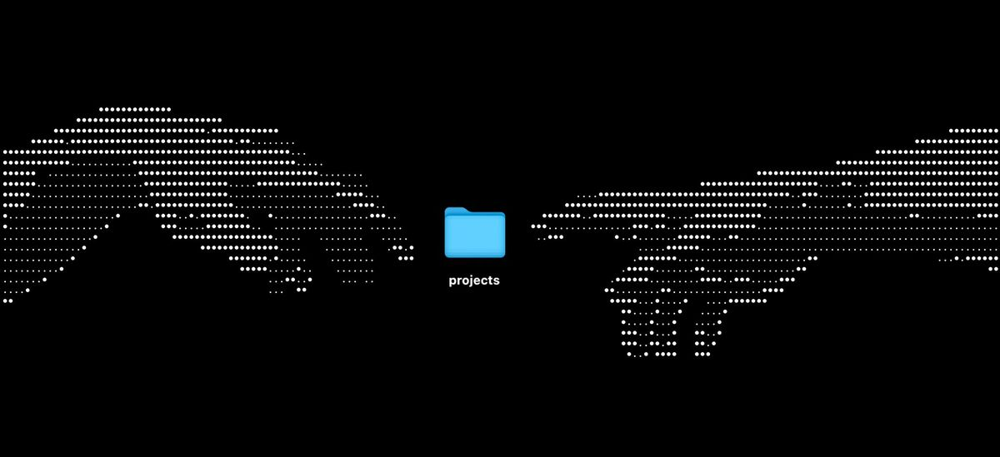

# ¡Hola! Mi nombre es Alex Arco Bronitt

**Estudiante de Grado Superior en DAW (IES Belén)** 💻 

  

Apasionado por la tecnología, el hardware y el desarrollo de software. Tras graduarme del Bachillerato Tecnológico en el IES Litoral, actualmente me encuentro cursando el ciclo de Desarrollo de Aplicaciones Web (DAW). 

El contenido de mis repositorios refleja mi evolución y proyectos prácticos: desde el diseño de landing pages y desarrollo backend en Java con testing, hasta la gestión y conexión de bases de datos relacionales, así como configuraciones de servidores y túneles SSH. 

Si tienes alguna duda o sugerencia sobre mi código, ¡no dudes en contactarme!

## 📫 Contacto

## ⚡ Tecnologías y Herramientas más usadas

### 🚀 Lenguajes

### 🗄️ Bases de Datos

### 🛠️ Entornos, Testing y Sistemas

## 📈 Trabajando en...

Actualmente sigo ampliando conocimientos en arquitecturas de software, flujos de trabajo con Git Flow, pruebas unitarias y administración de sistemas en Linux. 

